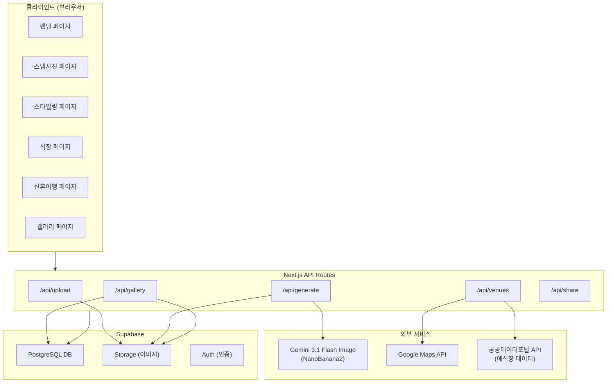
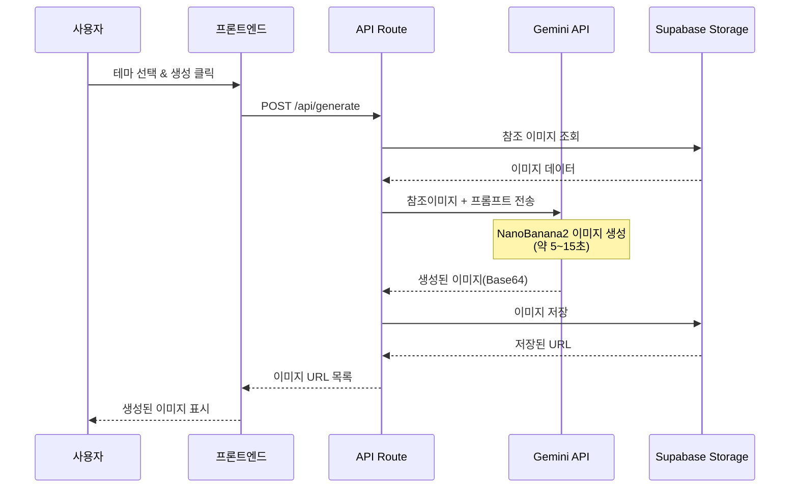

# MerryMe (메리미) - 상세 기획 및 구현 계획서

> **"상상 속의 우리 결혼식, 미리 만나보세요."**

## 1. 프로젝트 개요

### 1.1 서비스 정의
MerryMe는 AI 이미지 생성 기술(NanoBanana2 / Gemini 3.1 Flash Image)을 활용하여, 커플이 실제 결혼 준비 없이도 가상의 웨딩 스냅사진, 드레스 시착, 결혼식장 분위기 미리보기, 신혼여행 갤러리를 체험하고 소장할 수 있는 플랫폼입니다.

### 1.2 핵심 기술 스택

| 구분 | 기술 | 용도 |
|------|------|------|
| **프레임워크** | Next.js 15 (App Router) | 프론트엔드 + API Routes |
| **AI 이미지 생성** | Gemini 3.1 Flash Image (NanoBanana2) | 가상 웨딩 이미지 생성 |
| **데이터베이스** | Supabase (PostgreSQL) | 사용자 데이터, 갤러리 저장 |
| **이미지 저장소** | Supabase Storage | 업로드 사진 & 생성 이미지 저장 |
| **지도** | Google Maps JavaScript API | 결혼식장 위치 표시 |
| **예식장 데이터** | 공공데이터포털 API | 전국 결혼식장 정보 |
| **배포** | Vercel | 프로덕션 배포 |
| **스타일링** | Vanilla CSS + CSS Variables | 감성적 UI 디자인 |
| **인증** | Supabase Auth | 소셜 로그인 (카카오, 구글) |

---

## 2. 사용자 플로우 (5단계 상세 설계)


### Step 1: 랜딩 페이지 & 사진 업로드

**URL:** `/`

**사용자 행동:**
1. 서비스 소개 영상/애니메이션 확인
2. "FOR HER" / "FOR HIM" 영역에 각각 얼굴 사진 업로드 (최소 1장, 최대 5장)
3. 커플 이름 입력 (선택사항)
4. "가상 여행 시작하기" 버튼 클릭

**기술 구현:**
- 이미지 업로드 → Supabase Storage `uploads/` 버킷 저장
- 이미지 검증: 얼굴 인식 여부 확인 (Gemini Vision API로 검증)
- 세션 생성: 고유 `session_id` 발급 (비로그인 사용자도 체험 가능)
- 업로드된 이미지는 Gemini API에 참조 이미지로 전달됨

**UI 디자인 컨셉:**
- 배경: 부드러운 핑크-아이보리 그라데이션 + 파티클 애니메이션 (꽃잎 흩날리는 효과)
- 중앙: 두 개의 원형 프레임 (드래그앤드롭 업로드 영역)
- 하단: CTA 버튼 (골드 그라데이션, 호버 시 글로우 효과)
- 폰트: Google Fonts "Noto Serif KR" (제목) + "Pretendard" (본문)

---

### Step 2: 가상 스냅사진 생성

**URL:** `/snapshots`

**사용자 행동:**
1. 스냅사진 테마 선택 (3~5개 프리셋)
   - 🌸 봄날의 벚꽃 아래
   - 🏖️ 해변 선셋
   - 🏛️ 클래식 스튜디오
   - 🌿 숲속 가든
   - 🌙 도심 야경
2. "생성하기" 클릭 → AI가 4~6장의 스냅사진 생성
3. 마음에 드는 사진 선택 → 다음 단계로

**AI 프롬프트 전략:**
```
참조 이미지의 두 사람의 얼굴, 피부톤, 체형을 정확히 유지하면서,
[선택한 테마] 배경에서 커플이 다정하게 포즈를 취하는 
프리웨딩 스냅사진을 생성해주세요.
NanoBanana2 스타일: 따뜻하고 부드러운 톤, 몽환적인 빛 번짐,
필름 카메라 질감, 자연스러운 미소.
고해상도, 4:3 비율.
```

**기술 구현:**
- Gemini API `generateContent` with `responseModalities: ["IMAGE", "TEXT"]`
- 참조 이미지(HER/HIM) + 텍스트 프롬프트를 함께 전달
- 생성된 이미지를 Supabase Storage `generated/snapshots/` 저장
- 로딩 중 부드러운 스켈레톤 + 프로그레스 애니메이션

**UI 디자인 컨셉:**
- 분할 레이아웃: 좌측 테마 선택 패널 + 우측 생성 결과 갤러리
- 생성된 사진: 카드 형태, 호버 시 확대 + 골드 테두리
- "SAVE THE DATE" 스타일 오버레이 텍스트 옵션

---

### Step 3: 드레스 & 메이크업 (가상 스타일링)

**URL:** `/styling`

**사용자 행동:**
1. **드레스 선택** (카테고리별)
   - A라인 드레스 / 머메이드 드레스 / 볼 가운 / 미니 드레스
   - 턱시도: 클래식 블랙 / 네이비 / 화이트 / 슬림핏
2. **메이크업 선택**
   - 내추럴 / 글램 / 빈티지 / 한복 메이크업
3. "스타일링 적용" → AI가 선택한 드레스+메이크업을 적용한 이미지 생성
4. 여러 조합을 시도해보고 최종 선택

**AI 프롬프트 전략:**
```
참조 이미지 속 여성의 얼굴과 체형을 유지하면서,
[A라인 웨딩 드레스]를 입고 [내추럴 메이크업]을 한 모습을 생성.
스튜디오 조명, 전신 샷, 뒤에는 부드러운 보케 배경.
드레스의 레이스 디테일과 실크 소재감이 사실적으로 표현되어야 함.
```

**UI 디자인 컨셉:**
- 좌측: 사용자 모델 프리뷰 (생성된 이미지)
- 우측: 드레스/메이크업 선택 패널 (카루셀 형태)
- 하단: 스타일 조합 히스토리 (썸네일 슬라이더)
- 비교 모드: 두 스타일을 나란히 비교

---

### Step 4: 결혼식장 시뮬레이션

**URL:** `/venues`

**사용자 행동:**
1. **결혼식장 검색 & 탐색**
   - 지역별 필터 (서울, 경기, 부산 등)
   - 유형별 필터 (호텔 웨딩, 가든 웨딩, 하우스 웨딩, 성당/교회)
   - 지도에서 직접 탐색 (Google Maps)
2. **실제 예식장 정보 조회** (공공데이터 API)
   - 사업장명, 주소, 전화번호, 예식홀 수
   - 지도에 위치 마커 표시
3. **가상 예식 장면 생성**
   - 선택한 식장 스타일에서 커플이 예식을 올리는 장면 AI 생성
   - 3가지 시점: 입장, 서약, 부케 토스

**데이터 소스:**
- **공공데이터포털 API:** `http://api.data.go.kr/openapi/tn_pubr_public_wedding_and_ceremony_hall_api`
  - 전국 예식장 사업장명, 주소, 위도/경도, 전화번호, 예식홀 수
- **Google Maps JavaScript API:** 위도/경도 기반 지도 렌더링 + 마커

**AI 프롬프트 전략:**
```
참조 이미지 속 커플이 [가든 웨딩] 예식장에서 결혼식을 올리는 장면.
신부는 [이전에 선택한 드레스]를 입고, 신랑은 [선택한 턱시도]를 입음.
하객들이 박수를 치고, 꽃잎이 날리고, 자연광이 따스하게 비침.
세로 3:4 비율, 따뜻한 NanoBanana2 색감.
```

**UI 디자인 컨셉:**
- 상단: 지도 뷰 (Google Maps, 마커에 예식장 정보 팝업)
- 중단: 식장 카드 리스트 (가로 스크롤)
  - 각 카드: 대표 이미지(AI생성), 식장명, 주소, 예식홀 수
- 하단: 선택한 식장에서의 가상 예식 미리보기 (3장 슬라이드)
- 클릭 시 상세 모달: 식장 전화번호, 상세 주소, 실제 지도

---

### Step 5: 가상 신혼여행 갤러리

**URL:** `/honeymoon`

**사용자 행동:**
1. **여행지 선택** (대표 6곳 + 커스텀 입력)
   - 🗼 파리 (에펠탑, 몽마르트르)
   - 🏝️ 발리 (해변 선셋, 우붓 라이스테라스)
   - 🏔️ 스위스 (알프스, 인터라켄)
   - 🌸 교토 (벚꽃길, 기요미즈데라)
   - 🇬🇷 산토리니 (블루돔, 석양)
   - 🗽 뉴욕 (센트럴파크, 타임스퀘어)
   - ✏️ 직접 입력 (원하는 장소)
2. 각 여행지별 2~4장의 스냅사진 AI 생성
3. 전체 앨범 구성 → 최종 갤러리 완성

**AI 프롬프트 전략:**
```
참조 이미지 속 커플이 파리 에펠탑 앞에서 다정하게 사진을 찍고 있는 모습.
카페에 앉아 크루아상을 먹으며 미소짓는 모습.
세느강변을 산책하는 모습.
따뜻한 오후 햇살, 필름 카메라 톤, NanoBanana2 스타일.
```

**UI 디자인 컨셉:**
- 월드맵 인터랙티브 뷰 (선택한 여행지에 핀 표시)
- 선택한 여행지를 클릭하면 생성된 사진 갤러리 펼쳐짐
- 최종 앨범: 벽면 액자 스타일 그리드 레이아웃
- "HONEYMOON MEMORY LANE" 타이틀 + 부드러운 페이드인 애니메이션

---

### 최종: 갤러리 & 다운로드

**URL:** `/gallery/[sessionId]`

**기능:**
- 전체 여정(스냅→스타일링→예식→신혼여행)의 모든 이미지를 하나의 갤러리에 모아서 표시
- 개별 이미지 고해상도 다운로드
- 전체 앨범 ZIP 다운로드
- SNS 공유 (카카오톡, 인스타그램 스토리)
- 고유 갤러리 링크로 누구든 열람 가능

---

## 3. 기술 아키텍처



---

## 4. 데이터베이스 설계

### 4.1 테이블 설계

```sql
-- 세션 테이블 (비로그인 사용자도 사용 가능)
CREATE TABLE sessions (
  id UUID PRIMARY KEY DEFAULT gen_random_uuid(),
  user_id UUID REFERENCES auth.users(id) NULL, -- 로그인 시 연결
  couple_name_her TEXT,
  couple_name_him TEXT,
  her_photo_urls TEXT[],  -- Supabase Storage 경로 배열
  him_photo_urls TEXT[],
  status TEXT DEFAULT 'active', -- active, completed
  created_at TIMESTAMPTZ DEFAULT NOW(),
  updated_at TIMESTAMPTZ DEFAULT NOW()
);

-- 생성된 이미지 테이블
CREATE TABLE generated_images (
  id UUID PRIMARY KEY DEFAULT gen_random_uuid(),
  session_id UUID REFERENCES sessions(id) ON DELETE CASCADE,
  step TEXT NOT NULL, -- 'snapshot', 'styling', 'venue', 'honeymoon'
  theme TEXT, -- 테마 또는 장소명
  image_url TEXT NOT NULL, -- Supabase Storage 경로
  prompt TEXT, -- 사용된 프롬프트
  metadata JSONB, -- 추가 메타데이터 (드레스 종류, 식장명 등)
  is_selected BOOLEAN DEFAULT false, -- 사용자가 선택한 이미지 여부
  created_at TIMESTAMPTZ DEFAULT NOW()
);

-- 예식장 캐시 테이블 (공공데이터 API 응답 캐싱)
CREATE TABLE venue_cache (
  id SERIAL PRIMARY KEY,
  business_name TEXT NOT NULL,
  road_address TEXT,
  jibun_address TEXT,
  latitude DOUBLE PRECISION,
  longitude DOUBLE PRECISION,
  phone TEXT,
  hall_count INTEGER,
  representative TEXT,
  sido TEXT,
  sigungu TEXT,
  is_operating BOOLEAN DEFAULT true,
  cached_at TIMESTAMPTZ DEFAULT NOW()
);

-- 갤러리 공유 테이블
CREATE TABLE shared_galleries (
  id UUID PRIMARY KEY DEFAULT gen_random_uuid(),
  session_id UUID REFERENCES sessions(id) ON DELETE CASCADE,
  share_code TEXT UNIQUE NOT NULL, -- 짧은 공유 코드
  is_public BOOLEAN DEFAULT true,
  view_count INTEGER DEFAULT 0,
  created_at TIMESTAMPTZ DEFAULT NOW()
);
```

---

## 5. API 라우트 설계

### 5.1 이미지 업로드

```
POST /api/upload
Body: FormData { file, type: 'her' | 'him' }
Response: { url: string, sessionId: string }
```

### 5.2 AI 이미지 생성

```
POST /api/generate
Body: {
  sessionId: string,
  step: 'snapshot' | 'styling' | 'venue' | 'honeymoon',
  options: {
    theme?: string,           // Step 2: 스냅사진 테마
    dress?: string,           // Step 3: 드레스 종류
    makeup?: string,          // Step 3: 메이크업 스타일
    tuxedo?: string,          // Step 3: 턱시도 종류
    venueStyle?: string,      // Step 4: 식장 스타일
    venueName?: string,       // Step 4: 실제 식장명
    destination?: string,     // Step 5: 여행지
    scenes?: string[],        // Step 5: 세부 장면들
  }
}
Response: { 
  images: Array<{ id: string, url: string }>,
  promptUsed: string 
}
```

### 5.3 예식장 조회

```
GET /api/venues?sido=서울&sigungu=강남구&page=1&size=20
Response: {
  total: number,
  venues: Array<{
    name: string,
    address: string,
    lat: number,
    lng: number,
    phone: string,
    hallCount: number
  }>
}
```

### 5.4 갤러리 조회

```
GET /api/gallery/[sessionId]
Response: {
  session: SessionInfo,
  images: {
    snapshots: Image[],
    styling: Image[],
    venue: Image[],
    honeymoon: Image[]
  },
  shareUrl: string
}
```

### 5.5 갤러리 공유

```
POST /api/share
Body: { sessionId: string }
Response: { shareCode: string, shareUrl: string }
```

---

## 6. 프로젝트 디렉토리 구조

```
merryme/
├── public/
│   ├── fonts/                  # 커스텀 폰트
│   └── icons/                  # SVG 아이콘
├── src/
│   ├── app/
│   │   ├── layout.tsx         # 루트 레이아웃
│   │   ├── page.tsx           # 랜딩 페이지 (Step 1)
│   │   ├── globals.css        # 글로벌 스타일 + CSS Variables
│   │   ├── snapshots/
│   │   │   └── page.tsx       # 스냅사진 (Step 2)
│   │   ├── styling/
│   │   │   └── page.tsx       # 드레스 & 메이크업 (Step 3)
│   │   ├── venues/
│   │   │   └── page.tsx       # 결혼식장 (Step 4)
│   │   ├── honeymoon/
│   │   │   └── page.tsx       # 신혼여행 (Step 5)
│   │   ├── gallery/
│   │   │   └── [sessionId]/
│   │   │       └── page.tsx   # 최종 갤러리
│   │   └── api/
│   │       ├── upload/
│   │       │   └── route.ts
│   │       ├── generate/
│   │       │   └── route.ts
│   │       ├── venues/
│   │       │   └── route.ts
│   │       ├── gallery/
│   │       │   └── [sessionId]/
│   │       │       └── route.ts
│   │       └── share/
│   │           └── route.ts
│   ├── components/
│   │   ├── layout/
│   │   │   ├── Header.tsx
│   │   │   ├── Footer.tsx
│   │   │   ├── StepIndicator.tsx  # 진행 단계 표시
│   │   │   └── PageTransition.tsx
│   │   ├── landing/
│   │   │   ├── HeroSection.tsx
│   │   │   ├── PhotoUpload.tsx
│   │   │   └── FeatureShowcase.tsx
│   │   ├── snapshots/
│   │   │   ├── ThemeSelector.tsx
│   │   │   └── PhotoGrid.tsx
│   │   ├── styling/
│   │   │   ├── DressSelector.tsx
│   │   │   ├── MakeupSelector.tsx
│   │   │   └── StylePreview.tsx
│   │   ├── venues/
│   │   │   ├── VenueMap.tsx
│   │   │   ├── VenueCard.tsx
│   │   │   ├── VenueFilter.tsx
│   │   │   └── VenuePreview.tsx
│   │   ├── honeymoon/
│   │   │   ├── WorldMap.tsx
│   │   │   ├── DestinationCard.tsx
│   │   │   └── TravelGallery.tsx
│   │   ├── gallery/
│   │   │   ├── AlbumView.tsx
│   │   │   ├── ImageModal.tsx
│   │   │   └── ShareButton.tsx
│   │   └── ui/
│   │       ├── Button.tsx
│   │       ├── Card.tsx
│   │       ├── Loader.tsx        # 이미지 생성 로딩 애니메이션
│   │       ├── Modal.tsx
│   │       └── ImageCarousel.tsx
│   ├── lib/
│   │   ├── supabase/
│   │   │   ├── client.ts        # 브라우저 클라이언트
│   │   │   └── server.ts        # 서버 클라이언트
│   │   ├── gemini/
│   │   │   ├── client.ts        # Gemini API 클라이언트
│   │   │   └── prompts.ts       # 프롬프트 템플릿 모음
│   │   ├── google-maps/
│   │   │   └── config.ts        # Google Maps 설정
│   │   └── publicdata/
│   │       └── venues.ts        # 공공데이터 API 래퍼
│   ├── hooks/
│   │   ├── useSession.ts        # 세션 관리
│   │   ├── useImageGeneration.ts # 이미지 생성 상태
│   │   └── useVenues.ts         # 예식장 데이터
│   ├── stores/
│   │   └── sessionStore.ts      # Zustand 전역 상태 관리
│   └── types/
│       └── index.ts             # TypeScript 타입 정의
├── docs/
│   ├── planning.md              # 이 기획 문서
│   ├── api-spec.md              # API 명세서
│   └── design-system.md         # 디자인 시스템 문서
├── .env.local                   # 환경 변수
├── next.config.ts
├── package.json
└── tsconfig.json
```

---

## 7. 환경 변수

```env
# Supabase
NEXT_PUBLIC_SUPABASE_URL=your-supabase-url
NEXT_PUBLIC_SUPABASE_ANON_KEY=your-anon-key
SUPABASE_SERVICE_ROLE_KEY=your-service-role-key

# Gemini API (NanoBanana2)
GEMINI_API_KEY=your-gemini-api-key

# Google Maps
NEXT_PUBLIC_GOOGLE_MAPS_API_KEY=your-google-maps-key

# 공공데이터포털
PUBLIC_DATA_API_KEY=your-data-go-kr-service-key

# App
NEXT_PUBLIC_APP_URL=https://merryme.vercel.app
```

---

## 8. UI/UX 디자인 시스템

### 8.1 컬러 팔레트

| 토큰 | 색상 | 용도 |
|------|------|------|
| `--color-primary` | `#D4A574` | 골드/샴페인 (CTA, 강조) |
| `--color-primary-light` | `#E8CDB0` | 골드 밝은 톤 |
| `--color-secondary` | `#F5E6D3` | 아이보리 (배경) |
| `--color-accent` | `#C48B9F` | 로즈핑크 (액센트) |
| `--color-accent-light` | `#E8B4C8` | 연한 핑크 |
| `--color-bg-dark` | `#1A1A2E` | 다크 배경 (갤러리) |
| `--color-bg-cream` | `#FFF8F0` | 크림 배경 |
| `--color-text-primary` | `#2C2C2C` | 주요 텍스트 |
| `--color-text-secondary` | `#6B6B6B` | 보조 텍스트 |
| `--color-text-gold` | `#B8860B` | 골드 텍스트 |

### 8.2 타이포그래피

- **제목 (H1~H3):** `Noto Serif KR` - 우아하고 격식있는 느낌
- **본문:** `Pretendard` - 가독성 높은 한글 본문
- **영문 강조:** `Playfair Display` - 몽환적인 서체 (슬로건 등)

### 8.3 핵심 애니메이션

- **페이지 전환:** 부드러운 페이드+슬라이드 (300ms ease-out)
- **이미지 생성 로딩:** 반짝이는 골드 파티클 + 프로그레스 링
- **카드 호버:** scale(1.03) + 골드 그림자
- **꽃잎 파티클:** 랜딩 페이지 배경에 떨어지는 벚꽃잎 CSS 애니메이션
- **갤러리 이미지 등장:** Intersection Observer 기반 페이드인

---

## 9. Gemini API (NanoBanana2) 연동 상세

### 9.1 모델 정보
- **모델명:** `gemini-3.1-flash-image-preview` (NanoBanana2)
- **기능:** 텍스트 → 이미지 생성, 이미지 + 텍스트 → 이미지 편집
- **참조 이미지:** 최대 14장까지 입력 가능 (얼굴 일관성 유지에 활용)
- **해상도:** 512px ~ 4K 지원
- **비율:** 1:1, 3:4, 4:3, 16:9, 9:16 등

### 9.2 핵심 프롬프트 템플릿

각 단계별로 최적화된 프롬프트 템플릿을 `lib/gemini/prompts.ts`에 관리합니다.

**공통 접두사:**
```
이 참조 이미지 속 두 사람의 얼굴, 피부톤, 체형, 고유한 특징을 정확히 유지하세요.
NanoBanana2 스타일: 따뜻한 색감, 부드러운 빛 번짐, 필름 카메라 질감, 
자연스럽고 행복한 표정. SynthID 워터마크 포함.
```

### 9.3 이미지 생성 흐름



---

## 10. 공공데이터 API 연동 상세

### 10.1 전국결혼식장및예식장표준데이터

**엔드포인트:**
```
http://api.data.go.kr/openapi/tn_pubr_public_wedding_and_ceremony_hall_api
```

**요청 파라미터:**
| 파라미터 | 설명 | 필수 |
|---------|------|------|
| `serviceKey` | 인증키 | ✅ |
| `pageNo` | 페이지 번호 | ❌ |
| `numOfRows` | 결과 수 | ❌ |
| `type` | json / xml | ❌ |

**응답 데이터:**
- 사업장명, 시도명, 시군구명
- 소재지도로명주소, 소재지지번주소
- 위도, 경도
- 대표자명, 전화번호
- 예식홀수, 총직원수
- 운영여부

### 10.2 캐싱 전략
- 최초 로드 시 전체 데이터를 Supabase `venue_cache` 테이블에 저장
- 이후 24시간마다 Vercel Cron Job으로 갱신
- 프론트엔드는 캐시된 DB에서 조회 (API 직접 호출 X)

---

## 11. 단계별 구현 계획

### Phase 1: 프로젝트 초기화 & 기반 작업 (1~2일)
- [ ] Next.js 15 프로젝트 생성
- [ ] Supabase 프로젝트 연동 (DB, Storage, Auth)
- [ ] 글로벌 CSS 디자인 시스템 구축
- [ ] 공통 컴포넌트 (Button, Card, Modal, Loader 등)
- [ ] 환경 변수 설정

### Phase 2: 랜딩 페이지 (Step 1) (1~2일)
- [ ] 히어로 섹션 디자인 (파티클 애니메이션 포함)
- [ ] 사진 업로드 컴포넌트 (드래그앤드롭)
- [ ] 업로드 API 구현 (Supabase Storage)
- [ ] 세션 생성 로직
- [ ] 서비스 소개 섹션

### Phase 3: 스냅사진 생성 (Step 2) (2~3일)
- [ ] Gemini API 클라이언트 구현
- [ ] 프롬프트 템플릿 시스템
- [ ] 테마 선택 UI
- [ ] 이미지 생성 & 로딩 UX
- [ ] 생성 이미지 갤러리 뷰

### Phase 4: 드레스 & 메이크업 (Step 3) (2~3일)
- [ ] 드레스/턱시도 카탈로그 UI
- [ ] 메이크업 스타일 선택 UI
- [ ] AI 스타일링 이미지 생성
- [ ] 스타일 비교 기능

### Phase 5: 결혼식장 (Step 4) (2~3일)
- [ ] 공공데이터 API 연동 & 캐싱
- [ ] Google Maps 컴포넌트
- [ ] 식장 필터 & 검색
- [ ] 가상 예식 장면 AI 생성

### Phase 6: 신혼여행 갤러리 (Step 5) (2~3일)
- [ ] 여행지 선택 인터페이스
- [ ] 여행 스냅사진 AI 생성
- [ ] 월드맵 인터랙티브 뷰

### Phase 7: 최종 갤러리 & 공유 (1~2일)
- [ ] 통합 갤러리 페이지
- [ ] 이미지 다운로드 (개별/ZIP)
- [ ] SNS 공유 기능
- [ ] OG 메타태그 (공유 시 미리보기)

### Phase 8: 폴리싱 & 배포 (1~2일)
- [ ] 반응형 디자인 (모바일/태블릿)
- [ ] 성능 최적화 (이미지 lazy loading, API 캐싱)
- [ ] SEO 최적화
- [ ] Vercel 배포 & 도메인 설정

---

## 사용자 확인 필요 사항

> [!IMPORTANT]
> ### 1. API 키 준비 상태
> 아래 API 키들이 필요합니다. 이미 가지고 계신 것이 있나요?
> - **Gemini API Key** (Google AI Studio에서 발급)
> - **Google Maps API Key** (Google Cloud Console에서 발급)
> - **공공데이터포털 Service Key** (data.go.kr에서 발급)
> - **Supabase 프로젝트** (이미 생성되어 있는지?)

> [!IMPORTANT]
> ### 2. 인증(로그인) 방식
> - **옵션 A:** 비로그인으로만 운영 (세션 기반, URL 공유로 갤러리 접근)
> - **옵션 B:** 카카오/구글 소셜 로그인 지원 (갤러리를 계정에 연결)
> - **추천:** 처음에는 비로그인(A)으로 빠르게 시작하고, 이후 로그인(B) 추가

> [!IMPORTANT]
> ### 3. 우선순위
> 5단계 전체를 한번에 구현할지, 아니면 **Step 1(랜딩) → Step 2(스냅사진)** 부터 먼저 만들고 점진적으로 확장할지 결정이 필요합니다.

> [!WARNING]
> ### 4. AI 이미지 생성 비용
> Gemini 3.1 Flash Image API는 이미지당 비용이 발생합니다.
> - 512px: 약 $0.02/장
> - 1024px: 약 $0.04/장  
> - 4K: 약 $0.08/장
> 
> 사용자당 평균 20~30장 생성 시, 사용자 1명당 약 $0.6~$2.4의 API 비용이 예상됩니다.
> 초기에는 **1024px로 제한**하고, 프리미엄 사용자에게만 4K를 제공하는 것을 권장합니다.

> [!NOTE]
> ### 5. NanoBanana2 스타일 적용 방식
> NanoBanana2는 Gemini 3.1 Flash Image의 별칭입니다. "따뜻하고 부드러운 필름 느낌"의 감성은 **프롬프트 엔지니어링**으로 달성합니다. 별도의 모델 설정이 아닌, 프롬프트에 "NanoBanana2 style, warm film tones, soft bokeh, dreamy light leaks" 등의 스타일 키워드를 포함시키는 방식입니다.

---

## 검증 계획

### 자동화 테스트
- `npm run build` — 빌드 에러 없이 통과 확인
- Vercel 프리뷰 배포로 실제 환경 테스트

### 수동 검증
- 각 Step별 플로우 테스트 (사진 업로드 → 이미지 생성 → 갤러리)
- 모바일/태블릿 반응형 확인
- 이미지 생성 품질 및 주체 일관성 확인
- 공공데이터 API 응답 정상 여부
- Google Maps 지도 렌더링 확인
